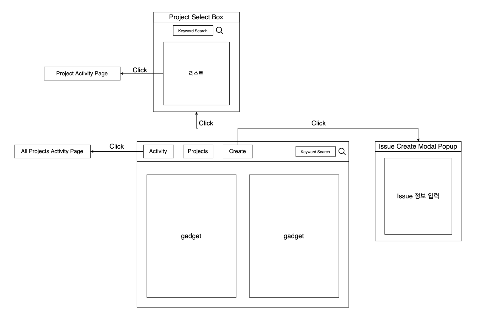
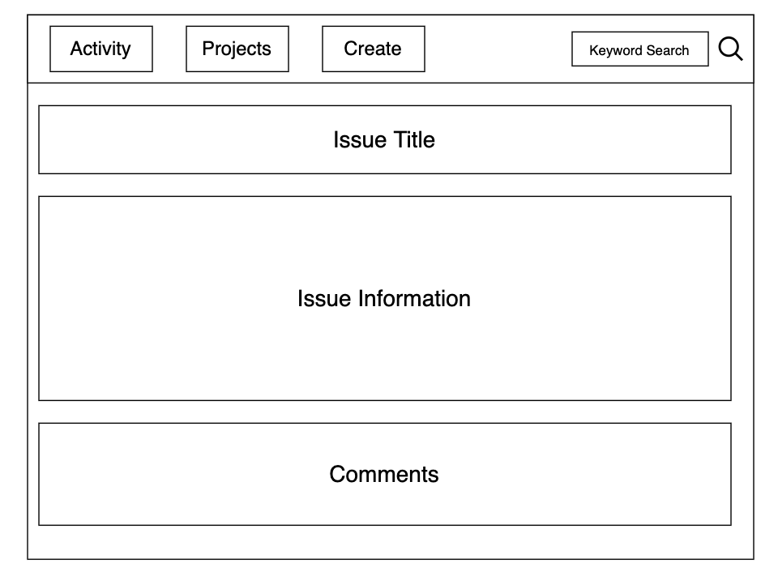
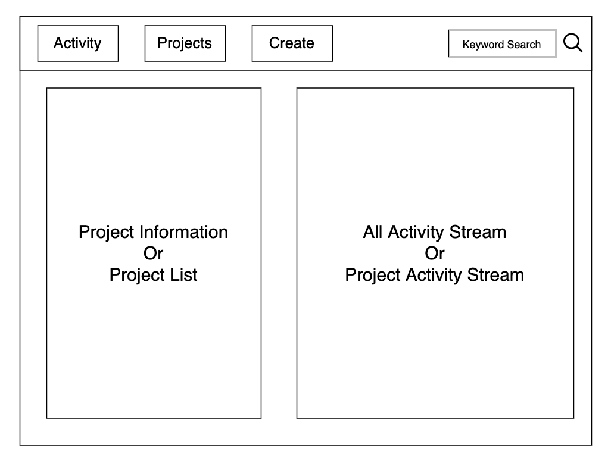

# Issue-Manager
## 프로젝트 설명
Issue-Manager 프로젝트는 javascript를 사용한 프로젝트로 react 공부 목적으로 진행된다. 아틀라시안의 협업 툴 Jira를 모티브로 만들어볼 예정이다.
## 기능
* 아이디를 통해 로그인, 세션 관리
* 프로젝트별 이슈 관리
* 이슈 activity stream 기능
* 이슈 내 코멘트 기능
* 메인 페이지에서 gadget을 통해 커스텀 화면 꾸리기 기능
* github 연동을 통해 이슈별 커밋 보여주기(like fisheye) 
## 페이지 개요 이미지
### Main Page

### IssueDetail Page

### Activity Page

## Frontend 파일 구조
### Components
* 헤더 메뉴 컴포넌트(Header.js) - 화면 상단 버튼들 모여있는 스티키 메뉴   
* 이슈 리스트 컴포넌트(IssueList.js) - 이슈 리스트 컴포넌트, 가제트들에 쓰임
* 가제트(Gadget.js) - 메인 화면 가제트 컴포넌트
### Page
* 메인 페이지(MainPage.js) - 가제트와 헤더가 나오는 메인 화면   
* 이슈 화면(IssuePage.js) - 한 이슈에 대한 설명, 코멘트가 나오는 화면
* 액티비티 화면(ActivityPage.js) - 액티비티 스트림 화면
## Backend GraphQL 요구사항
### Query
* **userById** -> user id에 대해서 user info get   
* **userBySeq** -> user seq에 대해서 user info get   
* **issuesByAsigneeSeq** -> asignee_seq에 따른 issue list get   
* **issuesByReporterSeq** -> reporter_seq에 따른 issue list get
* **issuesByProjectSeq** -> project_seq에 따른 issue list get  
* **issueById** -> issue id에 따른 issue info get 
* **projectsAll** -> 모든 프로젝트 리스트 get   
* **projectBySeq** -> project seq에 따른 project info get   
* **commentsByIssueSeq** -> issue seq에 따른 comment list get   
### Mutation
User,Project,Issue,Comment에 대한 Create,Delete,Update